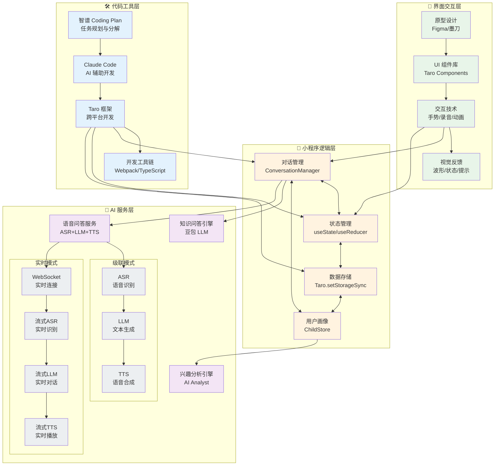
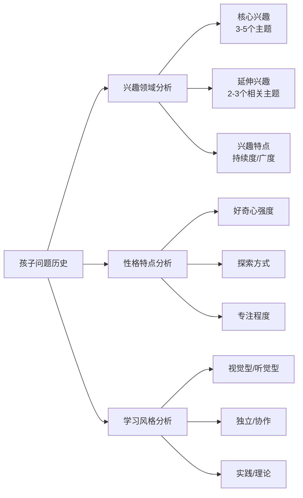
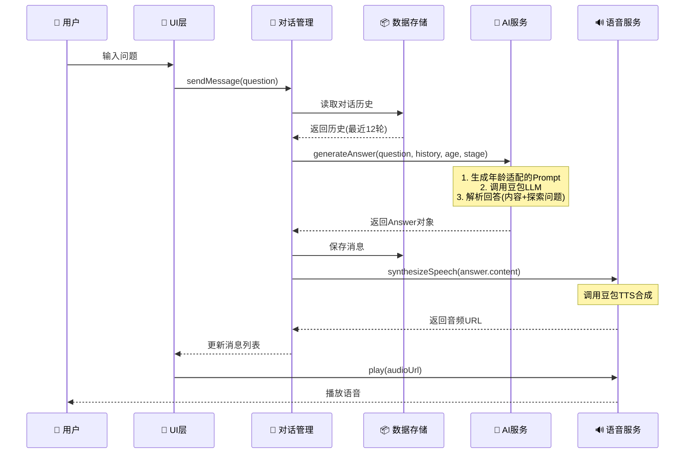
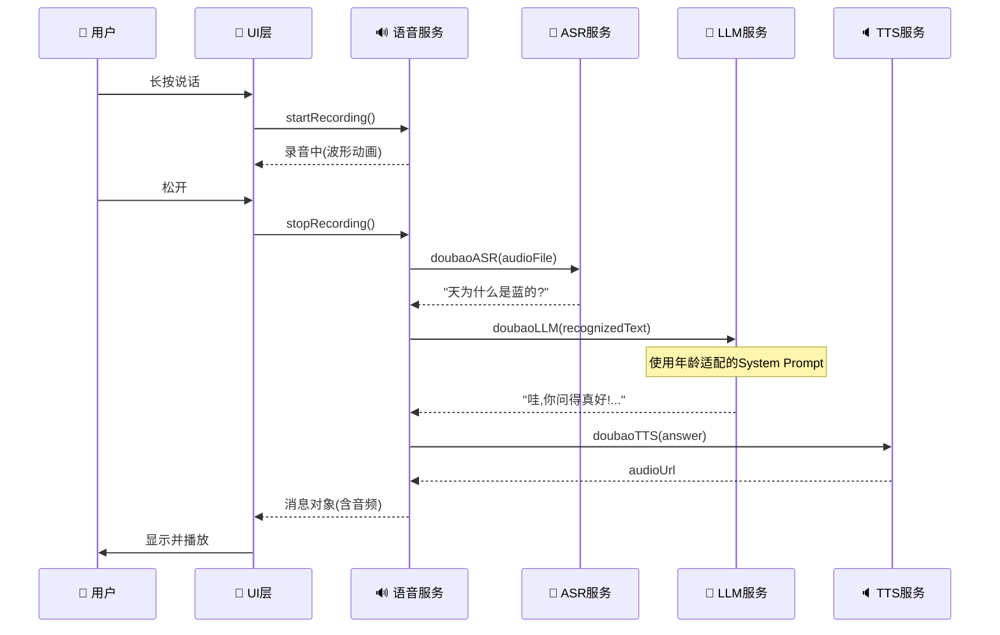
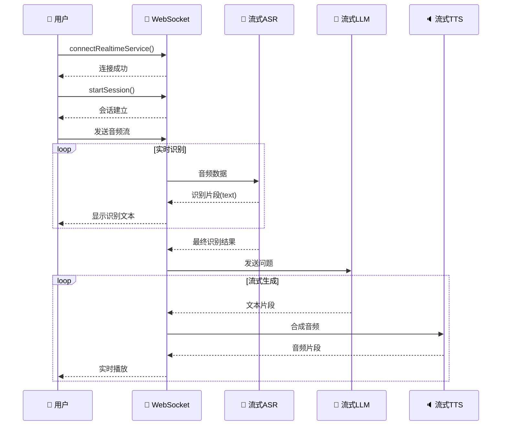

# 儿童问答 App 核心实现框架

## 系统整体架构图



---

## 一、🛠️ 代码工具层

### 核心工具矩阵

| 工具 | 定位 | 核心能力 | 在项目中的应用 |
|------|------|----------|----------------|
| **智谱 Coding Plan** | AI 任务规划器 | • 自动分解开发任务<br/>• 生成实施计划<br/>• 识别依赖关系 | 规划功能模块开发顺序<br/>生成技术方案建议 |
| **Claude Code** | AI 编程助手 | • 代码生成与补全<br/>• Bug 智能修复<br/>• 代码重构建议<br/>• 技术问答 | 编写业务逻辑代码<br/>调试复杂问题<br/>优化代码结构 |
| **Taro 框架** | 跨平台开发框架 | • 一套代码多端运行<br/>• React 语法支持<br/>• 完整的小程序 API | 微信/支付宝小程序开发<br/>H5 页面适配 |
| **TypeScript** | 类型系统 | • 静态类型检查<br/>• 智能提示<br/>• 接口定义 | 类型安全保证<br/>代码可维护性提升 |

### 开发工作流

```
需求分析 → 智谱 Coding Plan 规划 → Claude Code 开发 → Taro 构建运行
```

---

## 二、🤖 AI 服务层

### 2.1 知识问答引擎

**核心模型**: 豆包 doubao-pro-32k (火山方舟推理端点)

**年龄自适应策略**

| 年龄段 | 认知特点 | 知识深度 | 语言风格 | 比喻策略 |
|--------|----------|----------|----------|----------|
| **3-5岁** | 感知运动/前运算 | 只描述现象，不讲原理 | 叠词+拟声词+拟人化 | 拟人化：太阳公公、云朵宝宝 |
| **6-7岁** | 具体运算初期 | 简单因果关系 | "因为...所以..." | 生活类比：吹气球、滑滑梯 |
| **8-9岁** | 具体运算成熟 | 科学原理 | 递进逻辑表达 | 科学类比：光线像滑滑梯弯曲 |
| **10-12岁** | 形式运算 | 完整科学原理 | 专业术语+类比解释 | 科学类比：折射=车转弯、时空弯曲 |

**核心技术实现**

```typescript
// 动态 System Prompt 生成
function getStageSystemPrompt(stage: number): string {
  const stageConfig = {
    0: { knowledge: '极简知识', style: '拟人化' },
    1: { knowledge: '基础知识', style: '生活类比' },
    2: { knowledge: '科学原理', style: '科学类比' },
    3: { knowledge: '完整原理', style: '科学术语' }
  }
  return generatePrompt(stageConfig[stage])
}
```

**三大核心原则**
1. **温暖和关怀** - 开头表达认可和欣赏
2. **精简有效的比喻** - 每个回答一个恰到好处的比喻
3. **知识含量适配** - 严格符合年龄认知水平

### 2.2 语音问答服务

#### 级联模式 (Cascade Mode)

```
录音 → 豆包ASR识别 → 豆包LLM生成 → 豆包TTS合成 → 播放
```

**特点**:
- ✅ 实现简单，稳定可靠
- ✅ 成本较低
- ❌ 延迟较高 (3-5秒)
- 适合: 低并发场景

#### 实时模式 (Realtime Mode)

```
录音 → WebSocket → 流式ASR → 流式LLM → 流式TTS → 实时播放
```

**特点**:
- ✅ 延迟低 (1-2秒)
- ✅ 交互流畅自然
- ❌ 实现复杂
- ❌ 成本较高
- 适合: 高实时性要求场景

**技术对比**

| 特性 | 级联模式 | 实时模式 |
|------|----------|----------|
| **ASR 技术** | 文件识别 API | WebSocket 流式识别 |
| **LLM 调用** | 单次请求 | 流式响应 |
| **TTS 方式** | 非流式合成 | 流式音频返回 |
| **延迟** | 3-5 秒 | 1-2 秒 |
| **并发支持** | 低 | 高 |

### 2.3 兴趣分析引擎

**分析维度**



**应用场景**
- 📚 个性化内容推荐（书籍、动画、电影）
- 🎯 学习路径规划
- 💡 家长教育建议生成

---

## 三、📱 小程序逻辑层

### 3.1 对话管理 (ConversationManager)

**核心职责**

```typescript
class ConversationManager {
  // 对话历史管理
  private history: ConversationMessage[] = []

  // 添加消息
  addMessage(message: Message): void

  // 多轮对话上下文
  buildContext(): ConversationMessage[]

  // 探索问题生成
  generateCuriosityQuestion(answer: string): string[]
}
```

**关键实现**
- ✅ 对话历史持久化 (Taro.setStorageSync)
- ✅ 多轮对话上下文维护 (最近12轮)
- ✅ 代词指代消解 (从历史中找到"它"、"这个"的指代)
- ✅ 话题连贯性保证

### 3.2 状态管理

**状态架构**

```typescript
// 应用级状态
interface AppState {
  // 对话状态
  messages: Message[]
  isRecording: boolean
  isPlaying: boolean

  // 用户状态
  childProfile: {
    name: string
    age: number
    stage: number  // 0-3
  }

  // UI 状态
  currentTab: 'chat' | 'parent'
  showAnalysis: boolean
}
```

**状态管理模式**
- 使用 React Hooks (`useState`, `useReducer`)
- 局部状态与全局状态分离
- 状态更新遵循不可变原则

### 3.3 数据存储

**存储策略**

| 数据类型 | 存储方式 | 清理策略 | 用途 |
|----------|----------|----------|------|
| 对话历史 | Taro.setStorageSync | 永久保留 | 多轮对话上下文 |
| 用户画像 | Taro.setStorageSync | 永久保留 | 年龄、兴趣分析 |
| 临时音频 | 临时文件 | 播放后清理 | 录音、TTS 音频 |
| UI 设置 | Taro.setStorageSync | 永久保留 | 主题、语言偏好 |

---

## 四、🎨 界面交互层

### 4.1 原型设计

**设计工具**: Figma / 墨刀

**核心页面**

```
┌─────────────────────────────────┐
│  🎈 儿童问答小程序               │
├─────────────────────────────────┤
│                                 │
│  ┌───────────────────────────┐  │
│  │  对话消息列表              │  │
│  │  - 孩子: "天为什么是蓝的?" │  │
│  │  - AI: "哇,你问得真好!..." │  │
│  │  - 探索问题               │  │
│  └───────────────────────────┘  │
│                                 │
│  ┌───────────────────────────┐  │
│  │  [按住说话]     [文字输入]  │  │
│  └───────────────────────────┘  │
│                                 │
│  [家长中心]  [兴趣分析]         │
└─────────────────────────────────┘
```

### 4.2 交互技术

#### 手势交互

| 交互类型 | 技术实现 | 应用场景 |
|----------|----------|----------|
| **长按录音** | `onTouchStart` + `onTouchEnd` | 按住说话 |
| **上滑取消** | `onTouchMove` + 方向判断 | 取消录音 |
| **点击播放** | `onClick` | 播放回答 |
| **双击点赞** | `onDoubleClick` | 点赞回答 |

#### 录音交互

```typescript
// 录音状态机
const [recordState, setRecordState] = useState<
  'idle' | 'recording' | 'cancel' | 'processing'
>('idle')

// 长按开始录音
const handleTouchStart = () => {
  setRecordState('recording')
  voiceService.startRecording()
}

// 上滑进入取消区域
const handleTouchMove = (e) => {
  if (isInCancelZone(e)) {
    setRecordState('cancel')
  }
}

// 松开结束录音
const handleTouchEnd = async () => {
  if (recordState === 'cancel') {
    await voiceService.cancelRecording()
  } else {
    const result = await voiceService.stopRecording()
    // 发送消息...
  }
  setRecordState('idle')
}
```

#### 动画反馈

**录音波形动画**
```typescript
// 实时音量计算
const calculateVolume = (frameBuffer: ArrayBuffer): number => {
  const data = new Int16Array(frameBuffer)
  let sum = 0
  for (let i = 0; i < data.length; i++) {
    sum += Math.abs(data[i])
  }
  return sum / data.length / 32768
}

// 波形可视化
<Waveform volume={currentVolume} isRecording={isRecording} />
```

**状态过渡动画**
```typescript
// 使用 Taro 动画 API
const fadeIn = Taro.createAnimation({
  duration: 300,
  timingFunction: 'ease-in-out'
})

this.fadeIn.opacity(1).step()
this.setData({ fadeIn: this.fadeIn.export() })
```

### 4.3 视觉反馈系统

**反馈类型**

| 状态 | 视觉反馈 | 动画效果 |
|------|----------|----------|
| **录音中** | 波形跳动 + 倒计时 | 波峰实时变化 |
| **识别中** | Loading 动画 | 旋转圆圈 |
| **生成中** | 打字机效果 | 逐字显示 |
| **播放中** | 进度条 + 音波动画 | 进度平滑移动 |
| **错误** | 震动 + Toast 提示 | 抖动效果 |

---

## 数据流示例

### 文字问答完整流程



### 语音问答流程（级联模式）



### 语音问答流程（实时模式）



---

## 技术栈汇总

### 前端框架
- **Taro 4.1.5** - 跨平台小程序框架
- **React 18.3** - UI 框架
- **TypeScript** - 类型系统

### AI 服务
- **豆包 LLM** (doubao-pro-32k) - 知识问答
- **豆包 ASR** - 语音识别
- **豆包 TTS** - 语音合成
- **火山方舟** - 模型推理平台

### UI 交互
- **Taro Components** - 组件库
- **Taro Animation API** - 动画
- **Touch Events** - 手势交互
- **InnerAudioContext** - 音频播放

### 数据存储
- **Taro.setStorage** - 本地存储
- **Taro.getFileSystemManager** - 文件系统

---

## 核心代码文件结构

```
src/
├── services/              # AI 服务层
│   ├── ai.ts              # 知识问答引擎
│   ├── voice.ts           # 语音服务封装
│   └── doubao-realtime.ts # 实时语音服务
│
├── store/                 # 数据存储层
│   └── child.ts           # 用户画像管理
│
├── pages/                 # 页面逻辑层
│   ├── index/             # 主对话页
│   │   └── index.tsx      # 对话管理+交互逻辑
│   └── parent/            # 家长中心页
│       └── index.tsx      # 兴趣分析展示
│
├── types/                 # 类型定义
│   └── index.ts           # 接口定义
│
├── utils/                 # 工具函数
│   ├── request.ts         # 网络请求封装
│   └── format.ts          # 格式化工具
│
├── config/                # 配置文件
│   └── env.ts             # 环境配置
│
└── app.tsx                # 应用入口
```

---

## 核心配置说明

### 环境变量配置
```bash
# 豆包 LLM 配置
DOUBAO_API_ENDPOINT=https://ark.cn-beijing.volces.com/api/v3
DOUBAO_ACCESS_KEY=your_access_key
DOUBAO_LLM_MODEL=ep-20250403001607-h8hxw

# 豆包语音服务配置
DOUBAO_APP_ID=your_app_id
DOUBAO_SECRET_KEY=your_secret_key

# 豆包实时语音配置
DOUBAO_REALTIME_APP_ID=your_realtime_app_id
DOUBAO_REALTIME_ACCESS_KEY=your_realtime_access_key
DOUBAO_REALTIME_RESOURCE_ID=volc.speech.dialog
```

### 年龄段配置
| 阶段 | 年龄范围 | 认知发展阶段 | 知识含量 |
|------|----------|--------------|----------|
| 0 | 3-5岁 | 前运算阶段 | 极简知识：只描述现象 |
| 1 | 6-7岁 | 具体运算初期 | 基础知识：简单因果 |
| 2 | 8-9岁 | 具体运算成熟 | 中等知识：科学原理 |
| 3 | 10-12岁 | 形式运算阶段 | 完整知识：科学体系 |

---

## 技术亮点

✨ **年龄自适应** - 4 个年龄段动态调整回答深度和表达方式

✨ **比喻/类比系统** - 精心设计的比喻库，帮助理解抽象概念

✨ **双模式语音** - 支持级联和实时两种语音对话模式

✨ **探索引导** - 每次回答后自动生成延伸问题，保持好奇心

✨ **兴趣分析** - AI 驱动的兴趣领域和性格特点分析

✨ **流畅交互** - 手势、动画、实时反馈提升用户体验
